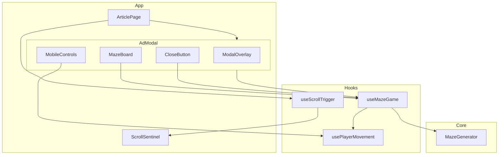
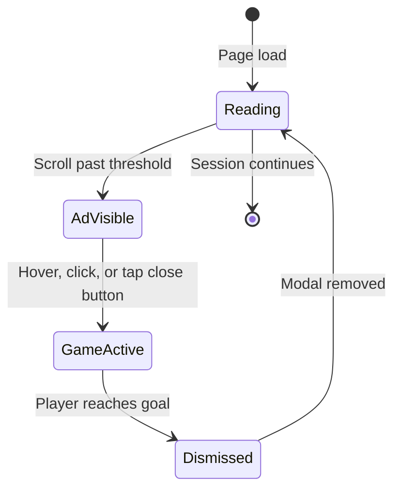
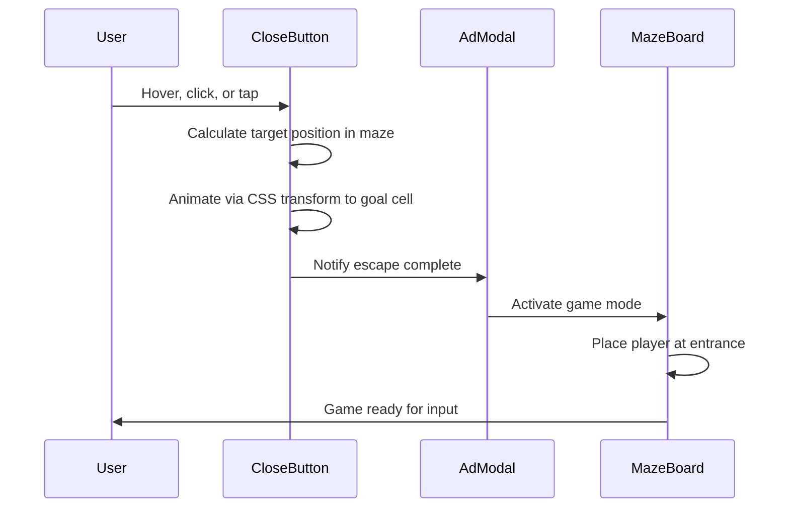

# Design Document: maze-ad-modal

## Overview

**Purpose**: This feature delivers a playful, interactive fake-advertisement experience to article readers. When users scroll through an article, a modal appears disguised as an ad containing a maze. Attempting to close the ad causes the close button to escape into the maze, turning it into a game the user must complete to dismiss the modal.

**Users**: Visitors to the article page will encounter the maze-ad modal as an interactive surprise element during reading.

### Goals
- Deliver a scroll-triggered modal that convincingly imitates a casual advertisement
- Animate the close button escaping into the maze when the user interacts with it
- Provide a playable maze game with keyboard and touch controls
- Dismiss the modal and restore the reading experience upon game completion

### Non-Goals
- Server-side logic or API integration (purely client-side)
- Persistent game state or scoring across sessions
- Accessibility compliance for the maze game (novelty feature)
- Multiple difficulty levels or maze customization
- Re-triggering the ad modal after dismissal

## Architecture

### Architecture Pattern & Boundary Map



**Architecture Integration**:
- **Selected pattern**: Component-based React architecture with custom hooks separating UI from game logic
- **Domain boundaries**: Maze generation logic (pure function) is isolated from React rendering; game state management lives in hooks; UI components are presentational
- **New components rationale**: Each component maps to a distinct UI region or behavioral concern (modal overlay, maze grid, controls, close button)
- **Steering compliance**: No steering documents exist yet; design follows standard React patterns

### Technology Stack

| Layer | Choice / Version | Role in Feature | Notes |
|-------|------------------|-----------------|-------|
| Frontend Framework | React 19 | Component rendering, state management | Latest stable |
| Build Tool | Vite 6 | Dev server, bundling, HMR | Latest stable |
| Language | TypeScript 5.x | Type-safe application code | Strict mode |
| Styling | CSS Modules | Scoped component styles | No external CSS framework |
| Runtime | Modern browsers | Target environment | ES2020+ features |

No backend, data store, or messaging layers are involved. See `research.md` for technology selection rationale.

## System Flows

### Modal Lifecycle Flow



### Close Button Escape Sequence



## Requirements Traceability

| Requirement | Summary | Components | Interfaces | Flows |
|-------------|---------|------------|------------|-------|
| 1.1 | Render scrollable article | ArticlePage | — | — |
| 1.2 | Free scrolling when modal hidden | ArticlePage, ModalOverlay | — | Modal Lifecycle |
| 2.1 | Show modal on scroll threshold | ArticlePage, ScrollSentinel | useScrollTrigger | Modal Lifecycle |
| 2.2 | Block background scroll when modal shown | ModalOverlay | useBodyScrollLock | Modal Lifecycle |
| 2.3 | Ad-styled modal | ModalOverlay | — | — |
| 2.4 | Visible close button in initial state | CloseButton | CloseButtonProps | — |
| 2.5 | Maze as ad visual content | MazeBoard | MazeBoardProps | — |
| 3.1 | Animate close button into maze on hover/click/tap | CloseButton | useMazeGame | Close Button Escape |
| 3.2 | Transition to game mode | AdModal | useMazeGame | Close Button Escape |
| 3.3 | Close button becomes goal | CloseButton, MazeBoard | MazeState | — |
| 4.1 | Place player at entrance | MazeBoard | useMazeGame | — |
| 4.2 | Keyboard arrow movement | MazeBoard | usePlayerMovement | — |
| 4.3 | Wall collision blocking | MazeBoard | usePlayerMovement | — |
| 4.4 | Generate solvable maze | MazeGenerator | generateMaze | — |
| 4.5 | Display player position | MazeBoard | MazeState | — |
| 4.6 | Display goal position | MazeBoard | MazeState | — |
| 5.1 | On-screen arrow buttons | MobileControls | MobileControlsProps | — |
| 5.2 | Touch movement identical to keyboard | MobileControls | usePlayerMovement | — |
| 5.3 | Touch-friendly button sizing | MobileControls | — | — |
| 6.1 | Dismiss modal on reaching goal | AdModal | useMazeGame | Modal Lifecycle |
| 6.2 | Restore scroll position | ArticlePage | useScrollTrigger | Modal Lifecycle |
| 6.3 | No re-trigger after dismissal | ArticlePage | useScrollTrigger | Modal Lifecycle |

## Components and Interfaces

| Component | Domain | Intent | Req Coverage | Key Dependencies | Contracts |
|-----------|--------|--------|--------------|------------------|-----------|
| ArticlePage | UI - Page | Root page with article content and scroll trigger | 1.1, 1.2, 2.1, 6.2, 6.3 | useScrollTrigger (P0) | State |
| ModalOverlay | UI - Modal | Fullscreen overlay blocking background | 2.2, 2.3 | — | — |
| CloseButton | UI - Modal | Animated close button that escapes into maze | 2.4, 3.1, 3.3 | useMazeGame (P0) | State |
| MazeBoard | UI - Game | Renders maze grid with player and goal | 2.5, 4.1, 4.2, 4.3, 4.5, 4.6, 3.3 | useMazeGame (P0) | State |
| MobileControls | UI - Game | On-screen directional buttons | 5.1, 5.2, 5.3 | usePlayerMovement (P0) | — |
| AdModal | UI - Container | Orchestrates modal phases | 3.2, 6.1 | useMazeGame (P0) | State |
| useScrollTrigger | Hook | IntersectionObserver-based scroll detection | 2.1, 6.2, 6.3 | — | State |
| useMazeGame | Hook | Maze game state machine and orchestration | 3.1, 3.2, 4.1, 4.4, 6.1 | MazeGenerator (P0), usePlayerMovement (P0) | State |
| usePlayerMovement | Hook | Keyboard and touch input handling | 4.2, 4.3, 5.2 | — | State |
| MazeGenerator | Core | Pure maze generation function | 4.4 | — | Service |

### Core Logic

#### MazeGenerator

| Field | Detail |
|-------|--------|
| Intent | Generate a solvable maze grid using DFS recursive backtracker |
| Requirements | 4.4 |

**Responsibilities & Constraints**
- Generate a 2D grid of cells with wall configurations
- Guarantee a solvable path from entrance to goal
- Pure function with no side effects or React dependency
- Entrance placed at top-left region, goal placed at bottom-right region

**Dependencies**
- None (standalone pure function)

**Contracts**: Service [x]

##### Service Interface
```typescript
interface Cell {
  walls: {
    top: boolean;
    right: boolean;
    bottom: boolean;
    left: boolean;
  };
}

type MazeGrid = Cell[][];

interface MazeConfig {
  rows: number;
  cols: number;
}

interface MazeResult {
  grid: MazeGrid;
  entrance: Position;
  goal: Position;
}

interface Position {
  row: number;
  col: number;
}

function generateMaze(config: MazeConfig): MazeResult;
```
- Preconditions: `rows >= 5`, `cols >= 5`
- Postconditions: A path exists from `entrance` to `goal`; all cells are reachable
- Invariants: Grid dimensions match config; walls are consistent between adjacent cells (if cell A has no right wall, cell B to the right has no left wall)

### Hooks

#### useScrollTrigger

| Field | Detail |
|-------|--------|
| Intent | Detect scroll threshold crossing and manage modal trigger state |
| Requirements | 2.1, 6.2, 6.3 |

**Responsibilities & Constraints**
- Create and observe a sentinel element via IntersectionObserver
- Track whether the modal has been triggered and dismissed
- Prevent re-triggering after dismissal (session flag)
- Provide a ref for the sentinel element placement

**Dependencies**
- Inbound: ArticlePage — consumes trigger state (P0)

**Contracts**: State [x]

##### State Management
```typescript
interface ScrollTriggerState {
  isTriggered: boolean;
  isDismissed: boolean;
  sentinelRef: React.RefObject<HTMLDivElement | null>;
  dismiss: () => void;
}

function useScrollTrigger(): ScrollTriggerState;
```

#### useMazeGame

| Field | Detail |
|-------|--------|
| Intent | Orchestrate maze game lifecycle: generation, phase transitions, completion |
| Requirements | 3.1, 3.2, 4.1, 4.4, 6.1 |

**Responsibilities & Constraints**
- Manage game phase transitions: `idle` → `ad-visible` → `escaping` → `playing` → `completed`
- Generate maze on modal appearance
- Calculate close button goal position within maze
- Detect when player reaches goal and signal completion

**Dependencies**
- Outbound: MazeGenerator — maze generation (P0)
- Outbound: usePlayerMovement — player position tracking (P0)

**Contracts**: State [x]

##### State Management
```typescript
type GamePhase = "idle" | "ad-visible" | "escaping" | "playing" | "completed";

interface MazeGameState {
  phase: GamePhase;
  maze: MazeResult | null;
  playerPosition: Position | null;
  startEscape: () => void;
  onEscapeAnimationEnd: () => void;
}

function useMazeGame(): MazeGameState;
```

#### usePlayerMovement

| Field | Detail |
|-------|--------|
| Intent | Handle keyboard and touch directional input, enforce wall collision |
| Requirements | 4.2, 4.3, 5.2 |

**Responsibilities & Constraints**
- Listen for keyboard arrow key events (prevent default to avoid page scroll)
- Expose a `move(direction)` function for on-screen button integration
- Validate movement against maze wall data before updating position
- Only active during `playing` phase

**Dependencies**
- Inbound: MazeBoard — renders position (P0)
- Inbound: MobileControls — calls move function (P0)

**Contracts**: State [x]

##### State Management
```typescript
type Direction = "up" | "down" | "left" | "right";

interface PlayerMovementState {
  position: Position;
  move: (direction: Direction) => void;
}

function usePlayerMovement(
  maze: MazeGrid,
  startPosition: Position,
  isActive: boolean
): PlayerMovementState;
```

### UI Components

#### ArticlePage

| Field | Detail |
|-------|--------|
| Intent | Root page rendering article content and mounting the scroll sentinel |
| Requirements | 1.1, 1.2, 6.2, 6.3 |

**Implementation Notes**
- Renders placeholder article content (lorem ipsum or similar) long enough to require scrolling
- Places the sentinel ref element at the scroll trigger point (e.g., ~30% down the article)
- Conditionally renders `AdModal` based on `useScrollTrigger` state
- Restores normal scroll behavior after modal dismissal

#### AdModal

| Field | Detail |
|-------|--------|
| Intent | Container component orchestrating modal overlay, close button, maze, and controls |
| Requirements | 2.2, 2.3, 2.4, 2.5, 3.2, 6.1 |

**Implementation Notes**
- Applies body scroll lock on mount, removes on unmount
- Renders `ModalOverlay`, `CloseButton`, `MazeBoard`, and `MobileControls`
- Transitions visual state based on `useMazeGame` phase
- Calls `dismiss` callback from `useScrollTrigger` when game completes

#### CloseButton

| Field | Detail |
|-------|--------|
| Intent | Animated close button that escapes into the maze on user interaction |
| Requirements | 2.4, 3.1, 3.3 |

**Implementation Notes**
- In `ad-visible` phase: rendered at top-right corner of modal, styled as typical ad close button ("X")
- On hover/click/tap: triggers `startEscape()`, begins CSS transform animation toward goal cell position
- Position calculation: uses `getBoundingClientRect` of the goal cell to compute translate offset
- On animation end: calls `onEscapeAnimationEnd()` to transition to `playing` phase
- In `playing` phase: rendered at goal cell position within the maze grid, styled as the goal marker

#### MazeBoard

| Field | Detail |
|-------|--------|
| Intent | Render the maze grid with walls, player indicator, and goal |
| Requirements | 2.5, 4.1, 4.5, 4.6, 3.3 |

**Implementation Notes**
- CSS Grid layout: each cell is a grid item with conditional border styles representing walls
- Player indicator: highlighted cell at `playerPosition`
- Goal indicator: close button icon at `maze.goal` position
- In `ad-visible` phase: maze displayed as static visual (ad content)
- In `playing` phase: maze is interactive with player visible

#### MobileControls

| Field | Detail |
|-------|--------|
| Intent | On-screen directional arrow buttons for touch devices |
| Requirements | 5.1, 5.2, 5.3 |

**Implementation Notes**
- D-pad layout: Up button on top, Left/Right on sides, Down on bottom
- Each button calls `move(direction)` from `usePlayerMovement`
- Minimum touch target size: 44x44px
- Visible only during `playing` phase
- Uses `touch-action: manipulation` to prevent double-tap zoom

## Data Models

### Domain Model

The feature has a simple domain with no persistence:

- **MazeGrid** (value object): 2D array of `Cell` entities, each owning its wall state
- **Position** (value object): Row/column coordinate pair
- **MazeResult** (aggregate): Combines grid, entrance, and goal positions
- **GamePhase** (domain event/state): Tracks modal lifecycle transitions

No database, no API, no event store. All state is ephemeral React component state.

## Error Handling

### Error Strategy
This is a purely client-side feature with no external dependencies. Error scenarios are minimal.

### Error Categories and Responses
- **Maze generation edge case**: If grid dimensions are invalid (< 5), clamp to minimum size — no user-facing error
- **Animation failure**: If CSS transition does not fire `transitionend`, use a timeout fallback (e.g., 1 second) to force phase transition to `playing`
- **Keyboard event conflicts**: Prevent default on arrow keys only while maze game is active; release on unmount

## Testing Strategy

### Unit Tests
- `generateMaze`: Verify grid dimensions match config, entrance and goal are placed correctly, a path exists from entrance to goal, wall consistency between adjacent cells
- `usePlayerMovement`: Verify movement in all four directions, wall collision blocking, no movement when inactive
- `useScrollTrigger`: Verify trigger fires on intersection, no re-trigger after dismissal

### Integration Tests
- Modal lifecycle: Scroll triggers modal → close button interaction starts escape → game active → reach goal → modal dismissed
- Keyboard input during game: Arrow keys move player, non-arrow keys ignored, arrow keys do not scroll page

### E2E/UI Tests
- Full flow: Load page → scroll → modal appears → interact with close button → navigate maze → reach goal → modal dismissed → continue reading
- Mobile flow: Same flow using on-screen arrow buttons instead of keyboard
- Re-trigger prevention: After dismissal, scrolling does not re-trigger modal
